```python
import os
import pandas as pd
import numpy as np
from IPython.core.display import display, HTML
display(HTML("<style>.container { width:100% !important; }</style>"))
import seaborn as sns
```


<style>.container { width:100% !important; }</style>


Nez prijde mraz A Okna zaskli, nez prijde zima led a snih,
spravim si boty, uz mi prasly a couhaji mi palce z nich.


```python
import glob, os

#"training_data/*.txt"

def read_training(gl):
    tr = {}
    for file in glob.glob(gl):
        n = int(file.split("/")[1].split(".")[0])
        with open(file) as f:
            fc = f.read()
        ss = fc.split("\n\n")
        ls = []
        ns = 0
        for s in ss:
                      
            tts = s.split("\n")
            xs, ys = [],[]
            for t in tts:
                if not t.strip():
                    continue
                x,y = t.strip().split(" ")
                xs.append(float(x))
                ys.append(float(y))
            ls.append((np.array(xs),np.array(ys)))
        tr[n] = ls           
    return tr

ts = read_training("training_data/*.txt")
```


```python
ff = [0.2942669,0.8612692, 0.2940692,0.5935954]
```


```python
        file = "ground_truth.txt"
        with open(file) as f:
            fc = f.read()
        ss = fc.split("\n\n")
        truth = []
        ns = 0
        for s in ss:
                      
            tts = s.split("\n")
            xs, ys = [],[]
            for t in tts:
                if not t.strip():
                    continue
                x,y = t.strip().split(" ")
                xs.append(float(x))
                ys.append(float(y))
            truth.append((np.array(xs),np.array(ys)))
```


```python
line = [(0,0),(1,0),(2,0),(2,1),(2,2),(1,2),(0,2),(0,1),(0,0)]
print(rdp(line,1))
```

    [(0, 0), (2, 0), (2, 2), (0, 2), (0, 0)]


```python
rdp(np.array([[1,2,4],[2,3,4]]))
```


    array([ True,  True])


```python

from math import sqrt

def distance(a, b):
    return  sqrt((a[0] - b[0]) ** 2 + (a[1] - b[1]) ** 2)

def point_line_distance(point, start, end):
    if (start == end):
        return distance(point, start)
    else:
        n = abs(
            (end[0] - start[0]) * (start[1] - point[1]) - (start[0] - point[0]) * (end[1] - start[1])
        )
        d = sqrt(
            (end[0] - start[0]) ** 2 + (end[1] - start[1]) ** 2
        )
        return n / d

def rdp(points, epsilon):
    """
    Reduces a series of points to a simplified version that loses detail, but
    maintains the general shape of the series.
    """
    dmax = 0.0
    index = 0
    for i in range(1, len(points) - 1):
        d = point_line_distance(points[i], points[0], points[-1])
        if d > dmax:
            index = i
            dmax = d
    if dmax >= epsilon:
        results = rdp(points[:index+1], epsilon)[:-1] + rdp(points[index:], epsilon)
    else:
        results = [points[0], points[-1]]
    return results
```


```python
truth
```


    [(array([0.7929485, 0.7359582, 0.6816007, 0.4393455, 0.2252267]),
      array([0.339311 , 0.3203614, 0.2888389, 0.3952906, 0.4550758])),
     (array([0.0348282, 0.0965201, 0.8977489, 0.9645847]),
      array([0.4237445, 0.4002476, 0.0946597, 0.0683163])),
     (array([0.0072337, 0.0614654, 0.9732773]),
      array([0.4650905, 0.4447939, 0.1039553])),
     (array([0.051887 , 0.5050433, 0.8697944, 0.9416248]),
      array([0.3393405, 0.1732875, 0.0331198, 0.0055366])),
     (array([0.0731117, 0.4670551, 0.9938561]),
      array([0.5505224, 0.4039691, 0.2127379])),
     (array([0.0556291, 0.07858  , 0.2001276, 0.2843062, 0.3097185, 0.3149509,
             0.3210829, 0.3098101, 0.300106 , 0.2487043, 0.2065121]),
      array([0.       , 0.0591272, 0.3721444, 0.5889685, 0.6509384, 0.7221935,
             0.7925525, 0.8079596, 0.8341819, 0.9175045, 0.9653042])),
     (array([0.4230318, 0.4000514, 0.0819417, 0.0628671]),
      array([0.9988101, 0.9362908, 0.0717401, 0.0198032])),
     (array([0.4074101, 0.3949614, 0.0663235, 0.047211 , 0.085392 ]),
      array([0.986459 , 0.9576308, 0.0960908, 0.0364569, 0.0223736])),
     (array([0.9785024, 0.8415208, 0.7036852, 0.5369754, 0.3890225, 0.2793829,
             0.2468939, 0.1186782]),
      array([0.2540487, 0.2246424, 0.2114625, 0.2133874, 0.2025545, 0.1909274,
             0.290053 , 0.2689485])),
     (array([0.2337369, 0.5574499]), array([0.0786706, 0.9667209])),
     (array([0.0052803, 0.0148188, 0.035008 , 0.3709271, 0.3846195]),
      array([0.0104675, 0.034749 , 0.0847015, 0.9655815, 1.       ])),
     (array([0.059775 , 0.1513797, 0.9229907, 0.995719 ]),
      array([0.5018503, 0.4661303, 0.1650373, 0.1262988])),
     (array([0.2826889, 0.248871 , 0.2982774, 0.2764948, 0.2465135, 0.0106729]),
      array([0.9922148, 0.8964783, 0.877982 , 0.8214985, 0.7293052, 0.0043781])),
     (array([0.26698  , 0.2701488, 0.2785394, 0.2974197, 0.2894587, 0.2649026,
             0.2256203, 0.1065189]),
      array([1.       , 0.9043563, 0.8419001, 0.7329143, 0.6031836, 0.4847042,
             0.3755037, 0.0279654])),
     (array([0.9631389, 0.0388489]), array([0.8789999, 0.0368077])),
     (array([0.9435369, 0.7991609, 0.3031482, 0.2497714, 0.1579637, 0.0817393,
             0.       ]),
      array([0.0169093, 0.1002987, 0.3924148, 0.420111 , 0.4581388, 0.4659754,
             0.4549463])),
     (array([0.1404765, 0.9010451]), array([0.0503997, 0.0398106])),
     (array([0.      , 0.752927]), array([0.1044441, 0.5871859])),
     (array([1.       , 0.953508 , 0.6026493, 0.4074519, 0.0395488]),
      array([0.0071693, 0.0179172, 0.1073932, 0.1503698, 0.2284971])),
     (array([0.102924 , 0.4313285, 0.9699243]),
      array([0.1904554, 0.1170101, 0.       ])),
     (array([0.       , 0.1044903]), array([0.8263067, 0.1555399])),
     (array([0.9296321, 0.6276762, 0.1309079]),
      array([0.1955061, 0.1278018, 0.0145787])),
     (array([0.9719577, 0.1088964, 0.0821385]),
      array([0.2402514, 0.0138886, 0.0068843])),
     (array([0.1140398, 0.1178388, 0.3719748]),
      array([0.0725055, 0.1661832, 0.9119816])),
     (array([1.       , 0.5730059, 0.1777405]),
      array([0.1017797, 0.0214674, 0.0058321])),
     (array([0.       , 0.305889 , 0.9535984]),
      array([0.7546781, 0.5261478, 0.0283698])),
     (array([0.0268345, 1.       ]), array([0.       , 0.2778088])),
     (array([0.4798554, 0.1127595]), array([0.8373752, 0.146634 ])),
     (array([0.9630928, 0.3589927, 0.124683 ]),
      array([0.0523208, 0.2450399, 0.3290089])),
     (array([0.8609002, 0.0583775]), array([0.0833149, 0.297485 ])),
     (array([0.0779694, 0.4101473, 0.8431702]),
      array([0.2171091, 0.1015775, 0.       ])),
     (array([0.101835 , 0.5489073, 0.947651 ]),
      array([0.2097394, 0.1102147, 0.0099466])),
     (array([0.1630133, 0.8514614]), array([0.2465313, 0.0530985])),
     (array([0.1742156, 0.7888308]), array([0.1815548, 0.       ])),
     (array([0.0701801, 0.5143327]), array([0.1472085, 1.       ])),
     (array([0.1319689, 0.0702994]), array([0.0196812, 0.9071307])),
     (array([0.6528668, 0.3661723]), array([0.9518612, 0.1337496])),
     (array([0.3063052, 0.2867483, 0.2549715, 0.2207035, 0.1008668, 0.0569183]),
      array([0.8990777, 0.7846564, 0.6500893, 0.536797 , 0.1631207, 0.0344824])),
     (array([0.3097221, 0.2972188, 0.0593652, 0.0371648]),
      array([0.0189765, 0.0817845, 0.8728022, 0.9063426])),
     (array([0.0028749, 0.0786902, 0.5514184]),
      array([0.1329563, 0.1804739, 0.8398906])),
     (array([0.       , 0.8887108]), array([0.0282946, 0.       ])),
     (array([0.1039984, 0.0166726]), array([0.8612732, 0.1503568])),
     (array([0.190841 , 0.246771 , 0.2483825]),
      array([0.9943411, 0.4185871, 0.2200708])),
     (array([0.       , 0.9323236]), array([0.565667 , 0.0139544])),
     (array([0.0346314, 0.9865486]), array([0.0536059, 0.4259561])),
     (array([0.7774142, 0.7356019, 0.6909333, 0.6688612, 0.1747878, 0.1173092]),
      array([0.9527574, 0.8830132, 0.7793145, 0.7413039, 0.1153325, 0.0519054])),
     (array([0.       , 0.9201595]), array([0.084673, 0.150533])),
     (array([0.1025507, 0.6606316, 1.       ]),
      array([0.0928583, 0.1442845, 0.185159 ])),
     (array([0.0826026, 0.2876695, 0.3022861, 0.3681324, 0.383679 , 0.5788783,
             0.6453741, 0.9528392]),
      array([0.0221541, 0.0994438, 0.1046351, 0.132306 , 0.1388362, 0.1312869,
             0.1487293, 0.3038485])),
     (array([0.0205576, 0.2849445, 0.5763139]),
      array([0.0595228, 0.4767149, 0.9348584])),
     (array([0.9736807, 0.8853375, 0.8027668, 0.037167 ]),
      array([0.0717493, 0.1226152, 0.1678113, 0.5868814])),
     (array([0.6401163, 0.5600686, 0.1084218]),
      array([0.9175405, 0.7875066, 0.0275672])),
     (array([0.3640968, 0.2047905]), array([0.1032299, 0.8193481])),
     (array([0.5596686, 0.4719453, 0.123021 , 0.0612912]),
      array([0.8902898, 0.7455652, 0.1615552, 0.0553949])),
     (array([0.619345 , 0.5930602, 0.4767695, 0.3341982, 0.2976436, 0.2218736,
             0.1481187, 0.0312884]),
      array([0.9765797, 0.9375315, 0.7455627, 0.5288116, 0.4731864, 0.3574803,
             0.2456489, 0.0678661])),
     (array([0.6694025, 0.390481 , 0.33923  , 0.3062502, 0.2651209, 0.1308882,
             0.       ]),
      array([0.9758846, 0.5530123, 0.4768657, 0.4278592, 0.3634569, 0.162371 ,
             0.       ])),
     (array([0.6528049, 0.5940679, 0.5212262, 0.4046733, 0.1663   , 0.1445552,
             0.0101012]),
      array([0.95974  , 0.9430967, 0.8316613, 0.6533554, 0.2717317, 0.2401191,
             0.0334825])),
     (array([0.0241036, 0.0404701, 0.0481829]),
      array([0.9305713, 0.3375793, 0.1000332])),
     (array([0.0149129, 0.0448017, 1.       ]),
      array([0.4665463, 0.4552406, 0.0995392])),
     (array([0.4120239, 0.3845654, 0.3232015, 0.065371 ]),
      array([0.879843 , 0.8121335, 0.6560695, 0.       ])),
     (array([0.9105214, 0.0825735]), array([0.0957313, 0.3332375])),
     (array([0.1020314, 0.3102676, 0.3935243, 0.8790836]),
      array([0.2965356, 0.1547311, 0.1309645, 0.       ])),
     (array([0.8959519, 0.7039789, 0.1712207, 0.100881 ]),
      array([0.0598453, 0.2068532, 0.5768203, 0.6272752])),
     (array([0.0357431, 0.0870028, 0.5375917]),
      array([0.1549114, 0.2277372, 0.8681895])),
     (array([0.2478602, 0.0565774]), array([0.0837625, 0.9777422])),
     (array([0.0752844, 0.2120366, 0.2771456, 0.5460403, 0.6088768, 0.6216255,
             0.6831144, 0.839785 , 0.9456382, 0.9921079]),
      array([0.0257355, 0.084626 , 0.1100651, 0.2069282, 0.2297593, 0.2344006,
             0.2567588, 0.313704 , 0.3521883, 0.3871713])),
     (array([0.4941187, 0.4418454, 0.2720402, 0.206921 , 0.1731954, 0.1356892,
             0.08328  , 0.0727905]),
      array([0.0518454, 0.1593006, 0.499851 , 0.6385184, 0.7106754, 0.7977195,
             0.9188702, 0.9437051])),
     (array([0.9489065, 0.8338354, 0.1297047]),
      array([0.3130981, 0.2853568, 0.115544 ])),
     (array([0.1148254, 0.1818325]), array([0.9139852, 0.1573927])),
     (array([0.0651431, 0.0981435, 0.1037173, 0.1079883, 0.1348191]),
      array([0.8992114, 0.4977816, 0.454521 , 0.4051113, 0.0859912])),
     (array([0.9423847, 0.9057735, 0.8764359, 0.8211553, 0.7635898, 0.6654183,
             0.596871 , 0.5490533, 0.377487 , 0.3128137, 0.       ]),
      array([0.2455664, 0.2238275, 0.2065605, 0.173604 , 0.1401152, 0.0839399,
             0.0597347, 0.0523065, 0.0412737, 0.0358079, 0.0137892])),
     (array([0.942154 , 0.8554663, 0.7734344, 0.7228125, 0.6084323, 0.2593121,
             0.0303403]),
      array([0.7654298, 0.6943477, 0.6270787, 0.5855831, 0.4971154, 0.2271155,
             0.0437591])),
     (array([0.1283877, 0.3431101, 0.5676359, 0.7777922, 1.       ]),
      array([0.5552122, 0.4737318, 0.3692165, 0.2442279, 0.0975918])),
     (array([0.0869473, 0.3106754, 0.5780408, 0.7200652, 0.7571373]),
      array([0.9414853, 0.6409805, 0.2957988, 0.0988271, 0.0474345])),
     (array([0.7849853, 0.434377 , 0.1698038, 0.139616 ]),
      array([0.0917839, 0.5399285, 0.8780812, 0.9229922])),
     (array([0.633309 , 0.5468626, 0.3162923, 0.1889567, 0.0780441, 0.0476108]),
      array([0.943263 , 0.822575 , 0.4964855, 0.3055204, 0.1281863, 0.0866371])),
     (array([0.1788259, 0.1742079, 0.1525833, 0.1235874, 0.104521 , 0.1030998,
             0.0575776, 0.0496586, 0.0471189]),
      array([0.9462611, 0.9185727, 0.7883691, 0.6135351, 0.494268 , 0.4823306,
             0.2012211, 0.1344635, 0.098665 ])),
     (array([0.9316583, 0.807753 , 0.1070171]),
      array([0.0424141, 0.1070489, 0.4631026])),
     (array([0.0986948, 0.1923929, 0.2221176, 0.3616717, 0.5158493]),
      array([0.0952476, 0.2907025, 0.352665 , 0.6179229, 0.9109786])),
     (array([0.       , 0.0869978, 0.525208 , 0.6857677, 0.8183983, 0.9101262]),
      array([0.7191246, 0.6184507, 0.2541119, 0.1610372, 0.0887103, 0.0387314])),
     (array([0.0453259, 0.2796552, 0.4205123, 0.4977445]),
      array([0.0672234, 0.5538427, 0.8369115, 0.9664535])),
     (array([0.3751341, 0.0927291]), array([0.1242457, 0.8830289])),
     (array([0.963474 , 0.8862571, 0.0658419]),
      array([0.155124 , 0.1492183, 0.0843894])),
     (array([0.6908725, 0.4799025, 0.2948063, 0.0273985]),
      array([0.9097784, 0.6586961, 0.4498733, 0.1517235])),
     (array([0.9594299, 0.5431749, 0.1970472, 0.1048546, 0.0364504]),
      array([0.1399329, 0.1077008, 0.0808549, 0.0737212, 0.0595541])),
     (array([0.       , 0.1715465, 0.2148932, 0.3017872, 0.9200865]),
      array([0.0527242, 0.091276 , 0.1046294, 0.1313317, 0.3069962])),
     (array([0.0985961, 0.123423 , 0.1500746]),
      array([0.8427161, 0.4584735, 0.0451816])),
     (array([0.1216357, 0.2059756]), array([0.8729785, 0.0978337])),
     (array([0.0769996, 0.9332755]), array([0.0178634, 0.075984 ])),
     (array([0.2208944, 0.1780663, 0.1387818]),
      array([0.0263335, 0.5123498, 0.9108855])),
     (array([0.071009 , 0.4760477, 0.5066809, 0.6325563, 0.892967 , 1.       ]),
      array([0.0895146, 0.1218831, 0.1243314, 0.1343986, 0.1551872, 0.1637378])),
     (array([0.1701738, 0.2688874, 0.3674095, 0.8884174]),
      array([0.1107186, 0.1341114, 0.1489478, 0.1851567])),
     (array([0.9858502, 0.9693267, 0.9563188, 0.9091043, 0.8887138, 0.8090562,
             0.6623571, 0.5669945, 0.4966928, 0.4965399, 0.3732338, 0.3023909,
             0.1956013, 0.1586093, 0.1286593, 0.0500238, 0.0371521, 0.02234  ]),
      array([0.0422908, 0.0421443, 0.041919 , 0.0409419, 0.0406693, 0.0396295,
             0.0373774, 0.0365647, 0.0357938, 0.0487263, 0.0468837, 0.0489779,
             0.0526636, 0.0534701, 0.0530005, 0.052272 , 0.052073 , 0.052188 ])),
     (array([0.94161  , 0.8456054, 0.7788614, 0.6405648, 0.5422111, 0.0978815,
             0.0770657]),
      array([0.3080723, 0.3057502, 0.3055609, 0.2992259, 0.2942327, 0.2864124,
             0.2860555])),
     (array([0.0377062, 0.0370345, 0.0357782, 0.0324588, 0.031909 , 0.0300365,
             0.0292497, 0.0276379, 0.0269607, 0.0258541, 0.0258223]),
      array([0.0235259, 0.087139 , 0.2086609, 0.4411527, 0.4794046, 0.6197592,
             0.6781828, 0.8105425, 0.8697546, 0.9675138, 0.9801448])),
     (array([0.0182228, 0.4874522, 0.4931542, 0.497519 , 0.5014039, 0.088539 ,
             0.0339468]),
      array([0.9669511, 0.9720302, 0.6633847, 0.3373213, 0.0192954, 0.0165571,
             0.0154777])),
     (array([0.1049318, 0.0945386, 0.0876103, 0.0815965]),
      array([0.0338422, 0.8898312, 0.915488 , 0.9377418])),
     (array([0.9603997, 0.8442587, 0.7492689, 0.27453  , 0.2089605, 0.0755028,
             0.0767796, 0.045548 ]),
      array([0.0839266, 0.0845006, 0.0852138, 0.0834665, 0.0825844, 0.0866022,
             0.0531995, 0.0541787])),
     (array([0.2465164, 0.2601194, 0.2593227]),
      array([0.8730656, 0.1798058, 0.1344287])),
     (array([0.9819594, 0.9412972, 0.6297847, 0.4457205, 0.3732088, 0.3448842,
             0.2017576, 0.0540497, 0.0259546]),
      array([0.1483578, 0.1457278, 0.1405005, 0.1382291, 0.1373252, 0.1370028,
             0.1300978, 0.1228812, 0.1217049]))]


```python
areaa([0,1,.5,0,1,.5],[0,0,.5,1,1,.5])
```


    0.0


```python

np.dot(xs, ys)
```


    0.5675009032483601


```python
np.roll(ys,1)
```


    array([0.1217049, 0.1483578, 0.1457278, 0.1405005, 0.1382291, 0.1373252,
           0.1370028, 0.1300978, 0.1228812])


```python


```


```python
def median(lst):
    sortedLst = sorted(lst)
    lstLen = len(lst)
    index = (lstLen - 1) // 2    
    return sortedLst[index] 


class Traj:
    def __init__(self,xsys):
        xs, ys = xsys
        self.xs = np.array(xs)
        self.ys = np.array(ys)
        self.xd = np.diff(xs)
        self.yd = np.diff(ys)
        self.dists = np.linalg.norm([self.xd, self.yd],axis=0)
        self.cuts = np.cumsum(self.dists)
        self.d = np.hstack([0,self.cuts])
        
    def xyIncr(self):
        return self.xs[0]<self.xs[-1], self.ys[0]<self.ys[-1]
    
    def rotateAndGetSlopeIntercept(self):
        #rx = self.xs*np.cos(th)-self.ys*np.sin(th)
        #ry = self.xs*np.sin(th)+self.ys*np.cos(th)
        from scipy import stats
        #A = np.vstack([rx,np.ones(len(rx))]).T
        #m,c = np.linalg.lstsq(A,ry,rcond=None)[0]
        m,c,_,_,_ = stats.linregress(self.xs,self.ys)
        return m,c

        
    def getPoints(self, offsets):        
        offdists = offsets * self.cuts[-1]
        #print("offdists:", offdists)
        #print("self.cuts:", self.cuts)
        ix = np.searchsorted(self.cuts, offdists)        
        #print("ix:", ix)
        offdists -= self.d[ix]
        #print("offdists decr:", offdists)
        #print("offidsts after decr:", offdists)
        segoffs = offdists/self.dists[ix]
        #print("xd:", self.xd)
        #print("yd:", self.yd)
        #print("xs:", self.xs)
        #print("ys:", self.ys)
        #print("seqoffs:", segoffs)
        x = self.xs[ix] + self.xd[ix]*segoffs
        y = self.ys[ix] + self.yd[ix]*segoffs
        return x,y        
       

    def getPoint(self, offset):     
        offdist = offset * self.cuts[-1]     
        i = np.searchsorted(self.cuts, offdist)
        #print("i:", i)
        #if i > 0:
        #print("decr: ", self.d[i])
        offdist -= self.d[i]
        #print("offidst after decr:", offdist)
        segoff = offdist/self.dists[i]
        xd = (self.xs[i+1] - self.xs[i])
        yd = (self.ys[i+1] - self.ys[i])
        #print("xd:", xd)
        #print("yd:", yd)
        #print("segoff:", segoff)
        x = self.xs[i] + xd*segoff
        y = self.ys[i] + yd*segoff
        return x,y

class SampleSet:
    

        
    
    def __init__(self, n, ll):
        # ll is list of tuples [x_array,y_array] for every trajectory in sample
        self.trajs = [Traj(l) for l in ll]
        self.n = n
        self.xp = None
        self.yp = None
        self.err= None
    

            
        
    def getDirectionDict(self):
        d = {}
        for i, t in enumerate(self.trajs):
            v = t.xyIncr()
            if v not in d:
                d[v] = [i]
            else:
                d[v].append(i)
        return d
        
        
    def getAvg(self, lims, eps):
        self.endpoints()
        if len(self.trajs) > 3:
            ts, _, _, _, _, _ = self.getfilteredtrajs(lims)
        else:
            ts = self.trajs
        if len(ts) < 2:
            ts = self.trajs
        ########################################################################################
        #ts = self.trajs
        #print(self.n, "picked", len(ts), "from", len(self.trajs))
        
        trajLen = median([len(t.xs) for t in ts])
        offs = np.linspace(0,1,trajLen)
        xm = []
        ym = []
        for t in ts:
            xs, ys = t.getPoints(offs)            
            xm.append(xs)
            ym.append(ys)
        
        self.xp, self.yp = zip(*rdp(list(zip(np.mean(xm, axis=0),np.mean(ym, axis=0))), eps))
        tx = truth[self.n][0]
        ty = truth[self.n][1]
        
        self.err = disterr(self.xp, self.yp, tx,ty)
    
    
    def endpoints(self):
        
        cs = np.array([[self.trajs[0].xs[0],self.trajs[0].xs[-1]],
                       [self.trajs[0].ys[0],self.trajs[0].ys[-1]]])
        xs = np.hstack([t.xs[0] for t in self.trajs] + [t.xs[-1] for t in self.trajs])
        ys = np.hstack([t.ys[0] for t in self.trajs] + [t.ys[-1] for t in self.trajs])       
        #print("C1:", cs[0][0], cs[1][0])
        #print("C2:", cs[1][0], cs[1][1])
        clabs = []
        oldclabs = []
        for j in range(10):
            for i in range(len(xs)):
                ap = np.array([[xs[i]],[ys[i]]])
                dists = np.linalg.norm(ap - cs, axis=0)
                clabs.append(np.argmin(dists))
                #print(ap, "->", dists, np.argmin(dists))            
            cx = np.array([
                np.mean(xs[np.where(np.array(clabs)==0)]),
                np.mean(xs[np.where(np.array(clabs)==1)])])
            cy = np.array([
                np.mean(ys[np.where(np.array(clabs)==0)]),
                np.mean(ys[np.where(np.array(clabs)==1)])])
            if oldclabs == clabs:
                #print("early exit", j)
                break
            oldclabs = clabs
            clabs = []
        #if sum(clabs) == len(clabs)/2:
            #print("succ")        
        
        for i,l in enumerate(clabs[:len(clabs)//2]):
            if l == 1:
                #print("kmean reversing", i)
                oldT = self.trajs[i]                
                reversedTraj = (np.flip(oldT.xs), np.flip(oldT.ys))
                self.trajs[i] = Traj(reversedTraj)
                
    def zslopeintr(self):        
        slopes = []
        inters = []
        
        for t in self.trajs:
            s, i = t.rotateAndGetSlopeIntercept()
            slopes.append(s)
            inters.append(i)
        return zscore(slopes), zscore(inters)
    def zcurv(self):
        curvatures = np.array([np.arctan(np.nan_to_num(t.yd/t.xd)).max() - np.arctan(np.nan_to_num(t.yd/t.xd)).min() for t in self.trajs])
        
        print("cs", curvatures)
        return zscore(curvatures)
    def zdist(self):
        xms = np.array([(t.xs[0]+t.xs[-1])/2 for t in self.trajs])
        yms = np.array([(t.ys[0]+t.ys[-1])/2 for t in self.trajs])
        xm = np.mean(xms)
        ym = np.mean(yms)
        #print(np.array([[xm],[ym]]) - np.array([xms,yms]))
        return zscore(np.linalg.norm(np.array([[xm],[ym]]) - np.array([xms,yms]), axis=0))
        
        
    def zlen(self):
        ls = np.array([t.cuts[-1] for t in self.trajs])
        #print(ls)
        return zscore(ls)
    

        
        # (a - a.mean(axis=0)) / a.std(axis=0)
    def getfilteredtrajs(self, lims):
        
        zl = self.zlen()
        #print(self.n, "zl", zl)
        #print("zl", zl)
        zd = self.zdist()
        #print("zd", zd)
        zs, zi = self.zslopeintr()
        #print("zc", zc)
        zc = self.zcurv()
        print("zc", zc)
        lenlim, dislim, slolim, intlim, curlim = lims

        lenout = [self.trajs[i] for i in np.where((zl<lenlim[0])|(zl>lenlim[1]))[0]]
        disout = [self.trajs[i] for i in np.where((zd<dislim[0])|(zd>dislim[1]))[0]]
        sloout = [self.trajs[i] for i in np.where((zs<slolim[0])|(zs>slolim[1]))[0]]
        intout = [self.trajs[i] for i in np.where((zi<intlim[0])|(zi>intlim[1]))[0]]
        curout = [self.trajs[i] for i in np.where((zc<curlim[0])|(zc>curlim[1]))[0]]
        
        lenix = (zl>lenlim[0])&(zl<lenlim[1])
        disix = (zd>dislim[0])&(zd<dislim[1])
        sloix = (zs>slolim[0])&(zs<slolim[1])
        intix = (zi>intlim[0])&(zi<intlim[1])
        curix = (zc>curlim[0])&(zc<curlim[1])

        filtix = np.where(lenix&disix&sloix&intix&curix)[0]

        filtered = [self.trajs[i] for i in filtix]
        return filtered, lenout, disout, sloout, intout, curout
        
    def pax(self, ax, lims, eps):
        
        ax.set_xlim(0,1)
        ax.set_xticks([])
        ax.set_yticks([])
        
        ax.set_ylim(0,1)


        filtered, lenout, disout, sloout, intout,curout = self.getfilteredtrajs(lims)
        for n, t in enumerate(self.trajs):    
            ax.plot(t.xs,t.ys, c="b", label=n)
        
        if len(self.trajs) > 3:    
            for n, t in enumerate(lenout):    
                ax.plot(t.xs,t.ys, c="r") 
            for n, t in enumerate(disout):    
                ax.plot(t.xs,t.ys, c="g")
            for n, t in enumerate(sloout):    
                ax.plot(t.xs,t.ys, c="magenta")
            for n, t in enumerate(intout):    
                ax.plot(t.xs,t.ys, c="cyan")
            for n, t in enumerate(curout):    
                ax.plot(t.xs,t.ys, c="grey")
        if self.xp is not None:
            ax.plot(self.xp,self.yp, marker='D', color='r', linewidth=3)
            
            #rx, ry = zip(*rdp(list(zip(self.xp,self.yp)), .05))
            #print(len(rx))
            #ax.plot(rx,ry, marker='D', color='red', linewidth=2)
        tx = truth[self.n][0]
        ty = truth[self.n][1]
        ax.plot(tx,ty, marker="o",color="black",linewidth=3)
            
        
        ax.set_xlabel("%d err:%.3f eps:%.3f" % (self.n, self.err, eps))
        #for t in self.trajs:    
        #    ax.plot(t.xs,t.ys, linestyle='--', marker='o', color='grey')
        #if self.xp is not None:
        #    ax.plot(self.xp,self.yp, marker='D', color='r', linewidth=3)
        #ax.set_xlabel(str(self.n))
        
def disterr(x1,y1, x2, y2):        
    sd = np.array([x1[0]-x2[0],y1[0]-y2[0]])
    ed = np.array([x1[0]-x2[-1],y1[0]-y2[-1]])
    if np.linalg.norm(sd) > np.linalg.norm(ed):
        x2 = np.flip(x2)
        y2 = np.flip(y2)
        
    offs = np.linspace(0,1,10)
    xrs1, yrs1 = Traj((x1,y1)).getPoints(offs)
    xrs2, yrs2 = Traj((x2,y2)).getPoints(offs)
    return np.sum(np.linalg.norm([xrs1-xrs2, yrs1-yrs2],axis=0))
        
def zscore(l):
    if len(np.unique(l)) == 1:
        return np.full(len(l),0.)
    return (np.array(l)  - np.mean(l)) / np.std(l)
        
def sho(i,ax, lims, eps):
    ss = SampleSet(i, ts[i])
    ss.getAvg(lims, eps)
    ss.pax(ax, lims, eps)

def show(i, lims, eps):
    f = plt.figure(figsize=(5,5))
    ax = f.gca()
    ss = SampleSet(i, ts[i])
    ss.getAvg(lims, eps)
    ss.pax(ax,lims, eps)
# 16,33,42,46,69

```


```python


import warnings
warnings.filterwarnings("ignore")
show(13, goodlims, .01)
```

    cs [2.70973782 3.00166462 3.11601694 3.07332047]
    zc [-1.67359178  0.16694901  0.88791779  0.61872498]
    cs [2.70973782 3.00166462 3.11601694 3.07332047]
    zc [-1.67359178  0.16694901  0.88791779  0.61872498]


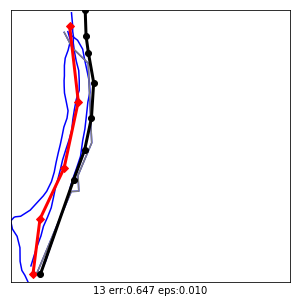


```python
hardlims = ((-1,1),(-1,1),(-100,100),(-100,100),(-1.5,1.5))
show(98, goodlims, .8)
```

    cs [3.13013597e+00 3.82555982e-01 2.50116324e-02 1.70916505e-02
     2.93015434e+00 3.10523770e+00 3.12409808e+00 2.98730179e+00
     2.26120579e+00 3.11700051e+00 3.11442443e+00 1.40320467e-02
     3.05330204e+00 1.64212379e-01 3.12168712e+00 1.52025400e-02
     6.14925348e-02 3.08342750e+00 3.07718405e+00 4.10783967e-03
     4.89011000e-02 2.39953150e-01 1.18925844e-02 2.97287695e+00
     1.34573832e-02 3.09272242e+00 2.87503762e-02 1.71560067e-02
     5.46406349e-02 1.14602817e-02 2.48063199e-02 4.51833211e-03
     3.13310908e+00 1.65340889e-02 7.61797050e-03 3.11788002e+00
     3.10744957e+00 3.12240044e+00 3.10288398e+00 3.10866380e+00
     2.72181288e-02 3.08650873e-02 2.65703927e-02 3.12657117e+00
     2.34852666e-02 5.07978582e-03 1.79435074e-02 1.20571384e-02
     2.83058897e-02 3.05906592e+00 4.55292667e-02 1.00668156e-01
     1.77669028e-03 2.45746475e-02 3.06741524e+00 3.12130208e+00
     3.08994934e+00 3.13788129e+00 2.98346971e-02 3.09932803e+00
     5.33451467e-02 1.64212379e-01 3.09196974e+00 3.12911913e+00
     3.01426644e+00 1.00983409e-01 9.88049830e-03 3.44092126e-02
     3.07865267e+00 3.05364154e+00 4.04198516e-02 1.78337948e-02
     3.31891452e-02 3.11979795e+00 1.73508747e-03 1.14811510e-01
     2.93685963e+00 3.08204310e+00 0.00000000e+00 2.78789926e+00
     2.90993710e+00 2.81795822e+00 2.20912858e-02 3.09035490e+00
     7.20715029e-02 3.10640846e+00 3.11616398e+00 3.09930604e+00
     4.48972827e-02 3.09107022e+00 2.73381300e-02 2.59583551e-01]
    zc [ 1.11881945 -0.71347952 -0.95191777 -0.95719942  0.98545622  1.10221536
      1.11479292  1.02356657  0.53934956  1.11005971  1.10834178 -0.9592398
      1.06758064 -0.85908794  1.11318511 -0.95845923 -0.92758948  1.08767063
      1.08350701 -0.96585803 -0.93598642 -0.80857813 -0.96066656  1.01394697
     -0.95962303  1.0938692  -0.94942448 -0.95715651 -0.93215885 -0.96095486
     -0.95205468 -0.96558428  1.12080215 -0.95757125 -0.96351721  1.11064624
      1.10369041  1.1136608   1.10064572  1.10450015 -0.9504463  -0.94801423
     -0.95087826  1.11644217 -0.95293567 -0.96520986 -0.95663134 -0.96055683
     -0.9497209   1.07142444 -0.93823502 -0.90146414 -0.96741262 -0.95220918
      1.07699242  1.11292833  1.0920199   1.12398463 -0.94870137  1.09827433
     -0.93302279 -0.85908794  1.09336726  1.11814135  1.04154868 -0.90125391
     -0.96200838 -0.94565073  1.0844864   1.06780705 -0.94164237 -0.9567045
     -0.94646437  1.11192526 -0.96744037 -0.89203226  0.98992783  1.08674741
     -0.96859746  0.89058953  0.9719738   0.91063517 -0.95386528  1.09229036
     -0.9205346   1.10299611  1.10950185  1.09825967 -0.93865648  1.09276739
     -0.95036628 -0.79548706]
    cs [3.13013597e+00 3.82555982e-01 2.50116324e-02 1.70916505e-02
     2.93015434e+00 3.10523770e+00 3.12409808e+00 2.98730179e+00
     2.26120579e+00 3.11700051e+00 3.11442443e+00 1.40320467e-02
     3.05330204e+00 1.64212379e-01 3.12168712e+00 1.52025400e-02
     6.14925348e-02 3.08342750e+00 3.07718405e+00 4.10783967e-03
     4.89011000e-02 2.39953150e-01 1.18925844e-02 2.97287695e+00
     1.34573832e-02 3.09272242e+00 2.87503762e-02 1.71560067e-02
     5.46406349e-02 1.14602817e-02 2.48063199e-02 4.51833211e-03
     3.13310908e+00 1.65340889e-02 7.61797050e-03 3.11788002e+00
     3.10744957e+00 3.12240044e+00 3.10288398e+00 3.10866380e+00
     2.72181288e-02 3.08650873e-02 2.65703927e-02 3.12657117e+00
     2.34852666e-02 5.07978582e-03 1.79435074e-02 1.20571384e-02
     2.83058897e-02 3.05906592e+00 4.55292667e-02 1.00668156e-01
     1.77669028e-03 2.45746475e-02 3.06741524e+00 3.12130208e+00
     3.08994934e+00 3.13788129e+00 2.98346971e-02 3.09932803e+00
     5.33451467e-02 1.64212379e-01 3.09196974e+00 3.12911913e+00
     3.01426644e+00 1.00983409e-01 9.88049830e-03 3.44092126e-02
     3.07865267e+00 3.05364154e+00 4.04198516e-02 1.78337948e-02
     3.31891452e-02 3.11979795e+00 1.73508747e-03 1.14811510e-01
     2.93685963e+00 3.08204310e+00 0.00000000e+00 2.78789926e+00
     2.90993710e+00 2.81795822e+00 2.20912858e-02 3.09035490e+00
     7.20715029e-02 3.10640846e+00 3.11616398e+00 3.09930604e+00
     4.48972827e-02 3.09107022e+00 2.73381300e-02 2.59583551e-01]
    zc [ 1.11881945 -0.71347952 -0.95191777 -0.95719942  0.98545622  1.10221536
      1.11479292  1.02356657  0.53934956  1.11005971  1.10834178 -0.9592398
      1.06758064 -0.85908794  1.11318511 -0.95845923 -0.92758948  1.08767063
      1.08350701 -0.96585803 -0.93598642 -0.80857813 -0.96066656  1.01394697
     -0.95962303  1.0938692  -0.94942448 -0.95715651 -0.93215885 -0.96095486
     -0.95205468 -0.96558428  1.12080215 -0.95757125 -0.96351721  1.11064624
      1.10369041  1.1136608   1.10064572  1.10450015 -0.9504463  -0.94801423
     -0.95087826  1.11644217 -0.95293567 -0.96520986 -0.95663134 -0.96055683
     -0.9497209   1.07142444 -0.93823502 -0.90146414 -0.96741262 -0.95220918
      1.07699242  1.11292833  1.0920199   1.12398463 -0.94870137  1.09827433
     -0.93302279 -0.85908794  1.09336726  1.11814135  1.04154868 -0.90125391
     -0.96200838 -0.94565073  1.0844864   1.06780705 -0.94164237 -0.9567045
     -0.94646437  1.11192526 -0.96744037 -0.89203226  0.98992783  1.08674741
     -0.96859746  0.89058953  0.9719738   0.91063517 -0.95386528  1.09229036
     -0.9205346   1.10299611  1.10950185  1.09825967 -0.93865648  1.09276739
     -0.95036628 -0.79548706]


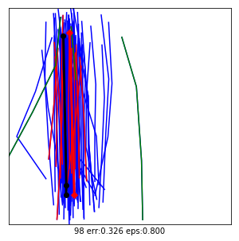


```python
# backup 51
lenlim = (-1.3,1.95)
dislim = (-8.,1.9)
slolim = (-1.7,1.7)
intlim = (-1.7,1.7)
curlim = (-1.5,1.5)
```


```python
# goodlims = ((-90,90),dislim,slolim,intlim) 50.9
# goodlims = (lenlim,dislim,(-90,90),intlim) 50.9
goodlims = (lenlim,dislim,(-90,90),(-90,90), curlim)
```


```python
nolims = ((-90,90),(-90,90),(-90,90),(-90,90),(-90,90))

```


```python


errs = []
lens = []
for i in ts:
    ss = SampleSet(i, ts[i])
    ss.getAvg(goodlims, .01)
    errs.append(ss.err)
    lens.append(len(ss.trajs))

l20 = [l for l in lens if l<20]
e20 = [errs[i] for i,l in enumerate(lens) if l < 20]
plt.scatter(e20,l20)
plt.figure()

plt.hist(l20, bins=30)
plt.figure()
plt.hist(lens, bins=30)
print(sum(errs))
```

    49.98778994486002


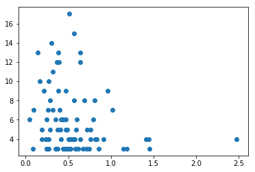


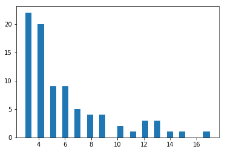


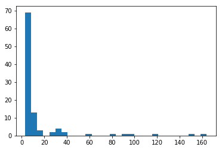


```python
errs = []
for i in ts:
    ss = SampleSet(i, ts[i])
    ss.getAvg(nolims, .01)
    errs.append(ss.err)
plt.hist(errs, bins=50)
print(sum(errs))
    
```

    47.76939405547903


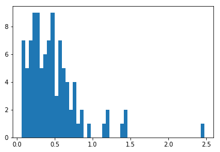


```python
r = 25

fig, axs = plt.subplots(nrows=r, ncols=4, figsize=(20,5*r))
li = sorted(list(ts.keys()))
faxs = [item for sublist in axs for item in sublist]

for i, ax in enumerate(faxs):
    sho(i, ax, nolims, .01)
plt.savefig("l3.png")
```


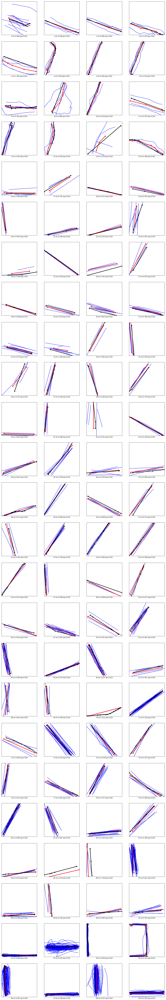


```python

#for i in sorted(list(ts.keys()))[:1]:
for i in [9,13,15]:
    print("====",i)
    ss = SampleSet(i, ts[i])
    ss.getAvg()
    ss.plot()
```

    ==== 9
    early exit 1
    succ
    kmean reversing 1
    kmean reversing 3
    kmean reversing 4
    picked 5 from 5
    zl [ 1.99316391 -0.35398802 -0.57464646 -0.5830589  -0.48147054]
    3
    ==== 13
    early exit 1
    succ
    picked 4 from 4
    zl [ 0.13127388 -1.22647074 -0.42163029  1.51682715]
    3
    ==== 15
    early exit 1
    succ
    kmean reversing 2
    picked 3 from 3
    zl [-1.2312805  1.2181029  0.0131776]
    4


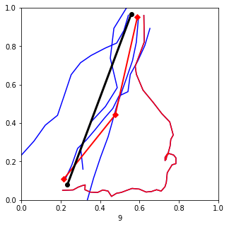


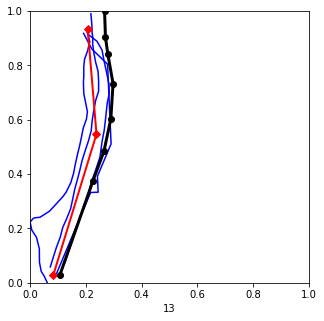


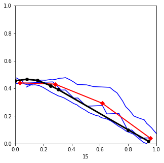


```python
%precision 3
import matplotlib.pyplot as plt
n = 93
ss = SampleSet(n,ts[n])
zl,zs,zi,zd = [], [],[],[]
zs,zi = ss.zslopeintr()
zd = ss.zdist()

for i in ts:
    ss = SampleSet(i,ts[i])
    if len(ss.trajs) > 3:
        zl = np.hstack([zl,ss.zlen()])
        zd = np.hstack([zd,ss.zdist()])
        _zs, _zi = ss.zslopeintr()
        zs = np.hstack([zs, _zs])
        zi = np.hstack([zi, _zi])

def figu(d, lab):
    fig = plt.figure(figsize=(5,5))
    ax = plt.axes()
    ax.set_xlabel(lab)
   
    _ = ax.hist(d, bins=100)
figu(zl,"len")
figu(zs,"slope")
figu(zi,"intercept")
figu(zd,"dist")
```

    /home/tomk/.local/lib/python3.6/site-packages/ipykernel_launcher.py:239: RuntimeWarning: invalid value encountered in true_divide


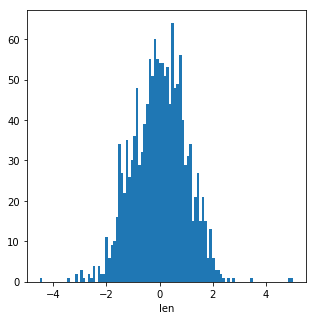


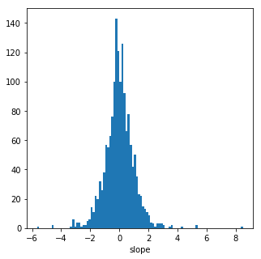


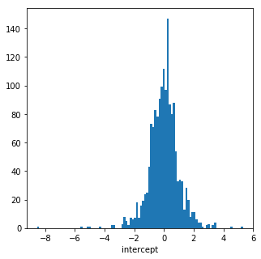


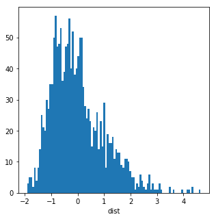


```python
from sklearn.cluster import DBSCAN


class Traj:
    def __init__(self):
        self.xs = xs
        self.ys = ys
        self.dists = np.linalg.norm([xs[:-1]-xs[1:], ys[:-1]-ys[1:]],axis=0)
        self.totaldist = sum(self.dists)
    def getpoint(offset):
        offdist = offset * self.totaldist
        ix = np.argmax(self.dists < offdist)
        

            

def getavg(df, eps):    
    X = df[["x","y"]].values
    

    clustering = DBSCAN(eps=eps, min_samples=5).fit(X)
    df["l"] = clustering.labels_

    xf = []
    yf = []
    for l in sorted(df.l.unique()):
        if l < 0:
            continue
        xl = df[df.l == l].x
        xf.append(sum(xl)/len(xl))
        yl = df[df.l == l].y
        yf.append(sum(yl)/len(yl))
    return xf, yf

def plotdf(df, la, eps=.2):
        
    fig = plt.figure(figsize=(5,5))
    ax = plt.axes()
    ax.set_xlim(0,1)
    ax.set_ylim(0,1)
    for n in df.n.unique():    
        x = df[df.n==n].x.values
        y = df[df.n==n].y.values    
        ax.plot(x,y, linestyle='--', marker='o', color='b')
    xf, yf = getavg(df, eps)
    ax.plot(xf,yf, marker='o', color='r')
    ax.set_xlabel(la)
    


for k in list(ts.keys())[:10]:    
    plotdf(ts[k],k,.3)
```


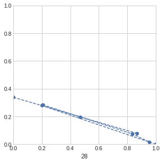


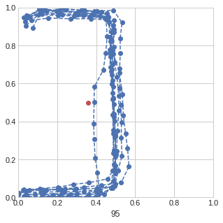


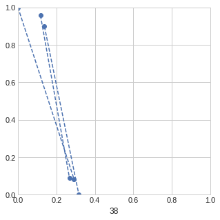


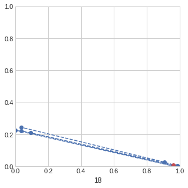


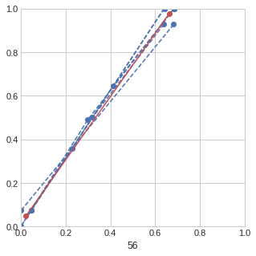


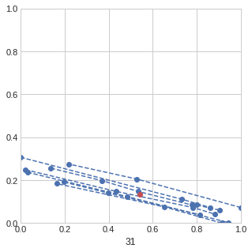


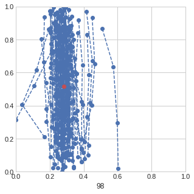


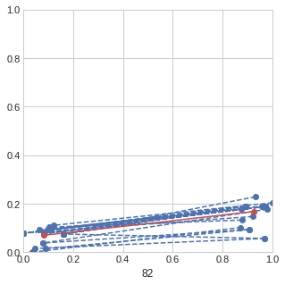


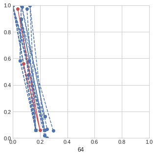


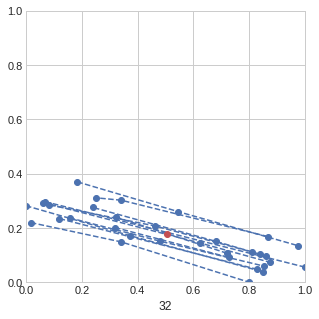


```python
df.loc[[1,2,8]]
```


<div>
<style scoped>
    .dataframe tbody tr th:only-of-type {
        vertical-align: middle;
    }

    .dataframe tbody tr th {
        vertical-align: top;
    }

    .dataframe thead th {
        text-align: right;
    }
</style>
<table border="1" class="dataframe">
  <thead>
    <tr style="text-align: right;">
      <th></th>
      <th>x</th>
      <th>y</th>
      <th>n</th>
    </tr>
  </thead>
  <tbody>
    <tr>
      <th>1</th>
      <td>0.083431</td>
      <td>0.055145</td>
      <td>0</td>
    </tr>
    <tr>
      <th>2</th>
      <td>0.433953</td>
      <td>0.866108</td>
      <td>1</td>
    </tr>
    <tr>
      <th>8</th>
      <td>0.433953</td>
      <td>0.866108</td>
      <td>4</td>
    </tr>
  </tbody>
</table>
</div>


```python
clustering
```


    DBSCAN(algorithm='auto', eps=3, leaf_size=30, metric='euclidean',
        metric_params=None, min_samples=1, n_jobs=None, p=None)


```python
df[["x","y"]].values
```


    array([[1.       , 0.2089335],
           [0.158354 , 0.       ],
           [1.       , 0.2089335],
           [0.158354 , 0.       ],
           [1.       , 0.2089335],
           [0.158354 , 0.       ],
           [1.       , 0.2089335],
           [0.158354 , 0.       ]])


```python

import matplotlib.pyplot as plt
plt.style.use('seaborn-whitegrid')
import numpy as np
```


```python
 fmri = sns.load_dataset("fmri")
```


```python
fmri.query("region == 'frontal'")
```


<div>
<style scoped>
    .dataframe tbody tr th:only-of-type {
        vertical-align: middle;
    }

    .dataframe tbody tr th {
        vertical-align: top;
    }

    .dataframe thead th {
        text-align: right;
    }
</style>
<table border="1" class="dataframe">
  <thead>
    <tr style="text-align: right;">
      <th></th>
      <th>subject</th>
      <th>timepoint</th>
      <th>event</th>
      <th>region</th>
      <th>signal</th>
    </tr>
  </thead>
  <tbody>
    <tr>
      <th>67</th>
      <td>s0</td>
      <td>0</td>
      <td>stim</td>
      <td>frontal</td>
      <td>-0.021452</td>
    </tr>
    <tr>
      <th>170</th>
      <td>s2</td>
      <td>6</td>
      <td>stim</td>
      <td>frontal</td>
      <td>0.101050</td>
    </tr>
    <tr>
      <th>267</th>
      <td>s10</td>
      <td>4</td>
      <td>stim</td>
      <td>frontal</td>
      <td>0.030044</td>
    </tr>
    <tr>
      <th>268</th>
      <td>s11</td>
      <td>4</td>
      <td>stim</td>
      <td>frontal</td>
      <td>0.075957</td>
    </tr>
    <tr>
      <th>269</th>
      <td>s3</td>
      <td>0</td>
      <td>stim</td>
      <td>frontal</td>
      <td>0.011056</td>
    </tr>
    <tr>
      <th>270</th>
      <td>s4</td>
      <td>0</td>
      <td>stim</td>
      <td>frontal</td>
      <td>-0.017516</td>
    </tr>
    <tr>
      <th>271</th>
      <td>s5</td>
      <td>0</td>
      <td>stim</td>
      <td>frontal</td>
      <td>-0.022977</td>
    </tr>
    <tr>
      <th>272</th>
      <td>s6</td>
      <td>0</td>
      <td>stim</td>
      <td>frontal</td>
      <td>-0.007947</td>
    </tr>
    <tr>
      <th>273</th>
      <td>s7</td>
      <td>0</td>
      <td>stim</td>
      <td>frontal</td>
      <td>-0.020864</td>
    </tr>
    <tr>
      <th>274</th>
      <td>s8</td>
      <td>0</td>
      <td>stim</td>
      <td>frontal</td>
      <td>0.018852</td>
    </tr>
    <tr>
      <th>275</th>
      <td>s9</td>
      <td>0</td>
      <td>stim</td>
      <td>frontal</td>
      <td>0.002888</td>
    </tr>
    <tr>
      <th>276</th>
      <td>s10</td>
      <td>0</td>
      <td>stim</td>
      <td>frontal</td>
      <td>0.074399</td>
    </tr>
    <tr>
      <th>277</th>
      <td>s11</td>
      <td>0</td>
      <td>stim</td>
      <td>frontal</td>
      <td>-0.028423</td>
    </tr>
    <tr>
      <th>278</th>
      <td>s12</td>
      <td>0</td>
      <td>stim</td>
      <td>frontal</td>
      <td>0.038392</td>
    </tr>
    <tr>
      <th>279</th>
      <td>s13</td>
      <td>0</td>
      <td>stim</td>
      <td>frontal</td>
      <td>-0.038266</td>
    </tr>
    <tr>
      <th>280</th>
      <td>s0</td>
      <td>1</td>
      <td>stim</td>
      <td>frontal</td>
      <td>-0.021054</td>
    </tr>
    <tr>
      <th>281</th>
      <td>s1</td>
      <td>1</td>
      <td>stim</td>
      <td>frontal</td>
      <td>-0.060273</td>
    </tr>
    <tr>
      <th>282</th>
      <td>s2</td>
      <td>1</td>
      <td>stim</td>
      <td>frontal</td>
      <td>-0.036433</td>
    </tr>
    <tr>
      <th>283</th>
      <td>s3</td>
      <td>1</td>
      <td>stim</td>
      <td>frontal</td>
      <td>-0.010262</td>
    </tr>
    <tr>
      <th>284</th>
      <td>s1</td>
      <td>0</td>
      <td>stim</td>
      <td>frontal</td>
      <td>-0.046049</td>
    </tr>
    <tr>
      <th>285</th>
      <td>s5</td>
      <td>1</td>
      <td>stim</td>
      <td>frontal</td>
      <td>-0.027179</td>
    </tr>
    <tr>
      <th>286</th>
      <td>s6</td>
      <td>1</td>
      <td>stim</td>
      <td>frontal</td>
      <td>0.009567</td>
    </tr>
    <tr>
      <th>287</th>
      <td>s7</td>
      <td>1</td>
      <td>stim</td>
      <td>frontal</td>
      <td>-0.023526</td>
    </tr>
    <tr>
      <th>288</th>
      <td>s8</td>
      <td>1</td>
      <td>stim</td>
      <td>frontal</td>
      <td>-0.009232</td>
    </tr>
    <tr>
      <th>289</th>
      <td>s9</td>
      <td>1</td>
      <td>stim</td>
      <td>frontal</td>
      <td>-0.005616</td>
    </tr>
    <tr>
      <th>290</th>
      <td>s10</td>
      <td>1</td>
      <td>stim</td>
      <td>frontal</td>
      <td>0.063558</td>
    </tr>
    <tr>
      <th>291</th>
      <td>s11</td>
      <td>1</td>
      <td>stim</td>
      <td>frontal</td>
      <td>-0.046235</td>
    </tr>
    <tr>
      <th>292</th>
      <td>s12</td>
      <td>1</td>
      <td>stim</td>
      <td>frontal</td>
      <td>0.044770</td>
    </tr>
    <tr>
      <th>293</th>
      <td>s13</td>
      <td>1</td>
      <td>stim</td>
      <td>frontal</td>
      <td>-0.046493</td>
    </tr>
    <tr>
      <th>294</th>
      <td>s0</td>
      <td>2</td>
      <td>stim</td>
      <td>frontal</td>
      <td>-0.009038</td>
    </tr>
    <tr>
      <th>...</th>
      <td>...</td>
      <td>...</td>
      <td>...</td>
      <td>...</td>
      <td>...</td>
    </tr>
    <tr>
      <th>1033</th>
      <td>s10</td>
      <td>7</td>
      <td>cue</td>
      <td>frontal</td>
      <td>-0.047084</td>
    </tr>
    <tr>
      <th>1034</th>
      <td>s5</td>
      <td>13</td>
      <td>cue</td>
      <td>frontal</td>
      <td>-0.014985</td>
    </tr>
    <tr>
      <th>1035</th>
      <td>s4</td>
      <td>13</td>
      <td>cue</td>
      <td>frontal</td>
      <td>-0.021514</td>
    </tr>
    <tr>
      <th>1036</th>
      <td>s3</td>
      <td>13</td>
      <td>cue</td>
      <td>frontal</td>
      <td>-0.047639</td>
    </tr>
    <tr>
      <th>1037</th>
      <td>s2</td>
      <td>13</td>
      <td>cue</td>
      <td>frontal</td>
      <td>0.047918</td>
    </tr>
    <tr>
      <th>1038</th>
      <td>s1</td>
      <td>13</td>
      <td>cue</td>
      <td>frontal</td>
      <td>0.028379</td>
    </tr>
    <tr>
      <th>1039</th>
      <td>s0</td>
      <td>13</td>
      <td>cue</td>
      <td>frontal</td>
      <td>-0.021729</td>
    </tr>
    <tr>
      <th>1040</th>
      <td>s13</td>
      <td>12</td>
      <td>cue</td>
      <td>frontal</td>
      <td>-0.020686</td>
    </tr>
    <tr>
      <th>1041</th>
      <td>s12</td>
      <td>12</td>
      <td>cue</td>
      <td>frontal</td>
      <td>-0.003034</td>
    </tr>
    <tr>
      <th>1042</th>
      <td>s11</td>
      <td>12</td>
      <td>cue</td>
      <td>frontal</td>
      <td>0.055766</td>
    </tr>
    <tr>
      <th>1043</th>
      <td>s10</td>
      <td>12</td>
      <td>cue</td>
      <td>frontal</td>
      <td>0.005711</td>
    </tr>
    <tr>
      <th>1044</th>
      <td>s9</td>
      <td>12</td>
      <td>cue</td>
      <td>frontal</td>
      <td>0.024292</td>
    </tr>
    <tr>
      <th>1045</th>
      <td>s7</td>
      <td>12</td>
      <td>cue</td>
      <td>frontal</td>
      <td>-0.014005</td>
    </tr>
    <tr>
      <th>1046</th>
      <td>s2</td>
      <td>7</td>
      <td>cue</td>
      <td>frontal</td>
      <td>-0.078363</td>
    </tr>
    <tr>
      <th>1047</th>
      <td>s10</td>
      <td>10</td>
      <td>cue</td>
      <td>frontal</td>
      <td>-0.016124</td>
    </tr>
    <tr>
      <th>1048</th>
      <td>s8</td>
      <td>10</td>
      <td>cue</td>
      <td>frontal</td>
      <td>-0.015141</td>
    </tr>
    <tr>
      <th>1049</th>
      <td>s10</td>
      <td>8</td>
      <td>cue</td>
      <td>frontal</td>
      <td>-0.052505</td>
    </tr>
    <tr>
      <th>1050</th>
      <td>s9</td>
      <td>8</td>
      <td>cue</td>
      <td>frontal</td>
      <td>-0.008729</td>
    </tr>
    <tr>
      <th>1051</th>
      <td>s8</td>
      <td>8</td>
      <td>cue</td>
      <td>frontal</td>
      <td>0.007278</td>
    </tr>
    <tr>
      <th>1052</th>
      <td>s7</td>
      <td>8</td>
      <td>cue</td>
      <td>frontal</td>
      <td>0.015765</td>
    </tr>
    <tr>
      <th>1053</th>
      <td>s6</td>
      <td>8</td>
      <td>cue</td>
      <td>frontal</td>
      <td>-0.063961</td>
    </tr>
    <tr>
      <th>1054</th>
      <td>s5</td>
      <td>8</td>
      <td>cue</td>
      <td>frontal</td>
      <td>-0.028292</td>
    </tr>
    <tr>
      <th>1055</th>
      <td>s4</td>
      <td>8</td>
      <td>cue</td>
      <td>frontal</td>
      <td>-0.160821</td>
    </tr>
    <tr>
      <th>1056</th>
      <td>s3</td>
      <td>8</td>
      <td>cue</td>
      <td>frontal</td>
      <td>-0.033848</td>
    </tr>
    <tr>
      <th>1057</th>
      <td>s2</td>
      <td>8</td>
      <td>cue</td>
      <td>frontal</td>
      <td>-0.069666</td>
    </tr>
    <tr>
      <th>1058</th>
      <td>s1</td>
      <td>8</td>
      <td>cue</td>
      <td>frontal</td>
      <td>-0.136059</td>
    </tr>
    <tr>
      <th>1059</th>
      <td>s0</td>
      <td>8</td>
      <td>cue</td>
      <td>frontal</td>
      <td>0.018165</td>
    </tr>
    <tr>
      <th>1060</th>
      <td>s13</td>
      <td>7</td>
      <td>cue</td>
      <td>frontal</td>
      <td>-0.029130</td>
    </tr>
    <tr>
      <th>1061</th>
      <td>s12</td>
      <td>7</td>
      <td>cue</td>
      <td>frontal</td>
      <td>-0.004939</td>
    </tr>
    <tr>
      <th>1062</th>
      <td>s11</td>
      <td>7</td>
      <td>cue</td>
      <td>frontal</td>
      <td>-0.025367</td>
    </tr>
  </tbody>
</table>
<p>532 rows × 5 columns</p>
</div>


